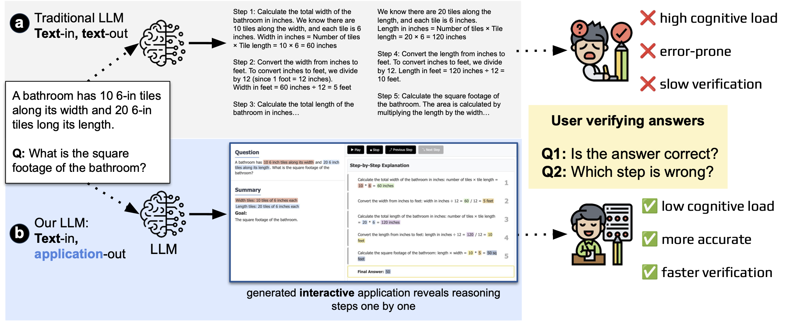

# Improving Human Verification of LLM Reasoning through Interactive Explanation Interfaces

This repository summarizes the paper **Improving Human Verification of LLM Reasoning through Interactive Explanation Interfaces**.

## Overview
Large Language Models often generate long chain-of-thought (CoT) explanations that overwhelm users.  
This project introduces **interactive explanation formats**—iCoT, iPoT, and iGraph—to reduce cognitive load and improve reasoning verification.

### Project Motivation

Given a GSM8K question, LLMs typically provide step-by-step reasoning followed by the final answer. However, such output
presentation is often static and long, posing a higher cognitive load to users and leading to slower and more erroneous answer
verification. In contrast, we prompt LLMs to generate an interactive HTML/JavaScript application wrapped around the reasoning. This
interface enables users to verify the reasoning more efficiently via tools of (a) navigation buttons (inspired by those in common IDEs)
and (b) colored highlights

### Project Pipline

Our Explanation Generation pipeline consists of three stages: (A) Tagged Information Generation, where an LLM produces
correct and erroneous GSM8K explanations annotated with reasoning tags; (B) Interface Template Design, where standardized
HTML/CSS templates ensure consistent structure and interactivity across formats; and (C) Explanation Interface Generation, where
tagged data and templates are combined to create interactive explanations in iCoT, iPoT, and iGraph formats for our user study

### Interface Overiew

Fig. 2. Examples of four explanation formats used in the study: (A) traditional Chain-of-Thought (CoT), (B) interactive Chain-of-
Thought (iCoT), (C) interactive Program-of-Thought (iPoT), and (D) interactive Graph (iGraph). Each format presents the same
reasoning steps in a different modality (textual, structured, code-like, or visual). For consistency, all four formats present the same
mathematical problem. 

## Quantative Results

## Qualitative Results

## Key Takeaways
- Interactive reasoning significantly improves users’ ability to verify LLM reasoning.
- Graph-based explanations outperform standard CoT.
- Structured, interactive interfaces reduce cognitive load.
- The approach generalizes to many reasoning domains.

