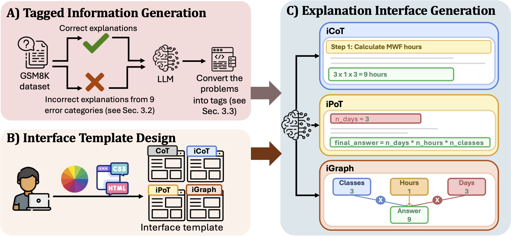
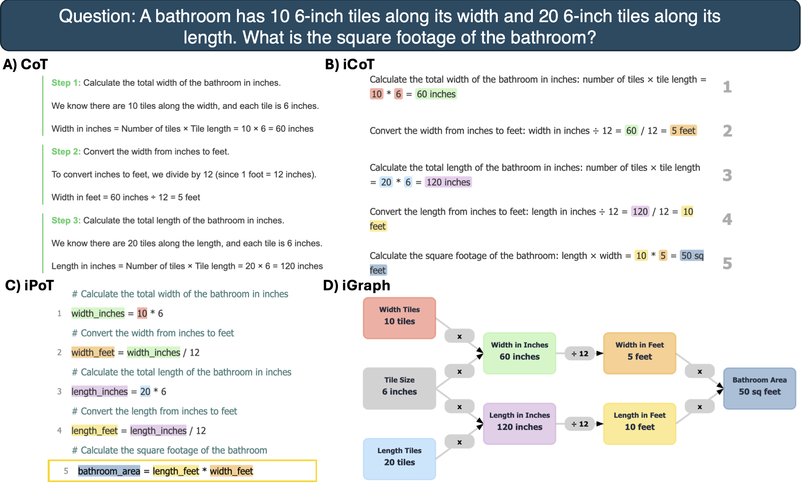

<div align="center">    

# Improving Human Verification of LLM Reasoning through Interactive Explanation Interfaces
by [Miles Zhou](https://github.com/Runtaozhou), [Giang Nguyen](https://giangnguyen2412.github.io/about/), [Nikita Kharya](), [Anh Totti Nguyen](https://www.eng.auburn.edu/directory/azn0044), and [Chirag Agarwal](https://chirag-agarwall.github.io/). 

[](https://interactive-explanation-llm.vercel.app/)
[](https://arxiv.org/abs/2510.22922)
[](https://huggingface.co/datasets/Miles1999/interactive-COT-data)
</div> 

<i>
The reasoning capabilities of Large Language Models (LLMs) have led to their increasing employment in several critical applications, particularly education, where they support problem-solving, tutoring, and personalized study. Chain-of-thought (CoT) reasoning capabilities are well-known to help LLMs decompose a problem into steps and explore the solution spaces more effectively, leading to impressive performance on mathematical and reasoning benchmarks. As the length of CoT tokens per question increases substantially to even thousands of tokens per question, it is unknown how users could comprehend LLM reasoning and detect errors or hallucinations. To address this problem and understand how reasoning can improve human-AI interaction, we present three new interactive reasoning interfaces: interactive CoT (iCoT), interactive Program-of-Thought (iPoT), and interactive Graph (iGraph). That is, we ask LLMs themselves to generate an interactive web interface wrapped around the original CoT content, which may be presented in text (iCoT), graphs (iGraph) or code (iPoT). This interface allows users to interact with and provide a novel experience in reading and validating the reasoning chains of LLMs. Across a study of 125 participants, interactive interfaces significantly improve user performance. Specifically, iGraph users score the highest error detection rate (85.6%), followed by iPoT (82.5%), iCoT (80.6%), all outperforming standard CoT (73.5%). Interactive interfaces also lead to faster user validation time-iGraph users are faster (57.9 secs per question) than the users of iCoT and iPoT (60 secs) and the standard CoT (64.7 secs). A post-study questionnaire shows that users prefer iGraph, citing its superior ability to enable them to follow the LLM's reasoning. We discuss the implications of these results and provide recommendations for the future design of reasoning models.
</i>
<div align="center">    

</div>

### Project Pipline

Our Explanation Generation pipeline consists of three stages: (A) Tagged Information Generation, where an LLM produces
correct and erroneous GSM8K explanations annotated with reasoning tags; (B) Interface Template Design, where standardized
HTML/CSS templates ensure consistent structure and interactivity across formats; and (C) Explanation Interface Generation, where
tagged data and templates are combined to create interactive explanations in iCoT, iPoT, and iGraph formats for our user study


### Interface Overiew

Examples of four explanation formats used in the study: (A) traditional Chain-of-Thought (CoT), (B) interactive Chain-of-
Thought (iCoT), (C) interactive Program-of-Thought (iPoT), and (D) interactive Graph (iGraph). Each format presents the same
reasoning steps in a different modality (textual, structured, code-like, or visual). For consistency, all four formats present the same
mathematical problem. 

# 1. Requirements
```
python==3.10.15
anthropic==0.49.0
pandas==2.1.4
tqdm==4.66.4
numpy==1.26.4
matplotlib==3.8.0
```

# 2. How to Generate Intermediate Tagged information

Run the following command to execute the script:

```bash
python3 tag_gen.py
```

The resulting intermediate tagged information will be saved in the tags directory. 

# 3. How to Generate The complete interactive interfaces

Run the following command to execute the script:

```bash
python3 interface_gen.py --interface_type "$interface_type" --error_type "$error_type" --correctness "$correctness" --sample_count "$sample_count"
```

## Parameters:
- `--interface_type`: Define the type of interfaces:
  - `cot`, 
  - `icot`,
  - `ipot`,
  - `igraph`,
- `--error_type`: Specific type of errors that are in the interface
  - `NA`, (no error)
  - `CA`, (calculation error)
  - `CO`, (counting error)
  - `CS`, (contradictory step)
  - `CV`, (context value error)
  - `FC`, (formula confusion error)
  - `HA`, (hallucination error)
  - `MS`, (missing step error)
  - `OP`, (operator error)
  - `UC`, (unit conversion error)
- `--correctness"`: the correctness of the expanation:
  - `right`: the answer is correct, only go with NA error_type. 
  - `wrong`: the answer is incorrect. 
- `--sample_count`: integer indicating how many samples you want to generate for each error type
  - `sample_count`: integer between 1 to 50


The resulting intermediate tagged information will be saved in the tags directory. 

## Huggingface Experiment Link: 

https://huggingface.co/spaces/Miles1999/interactive-llm-xai-TEST